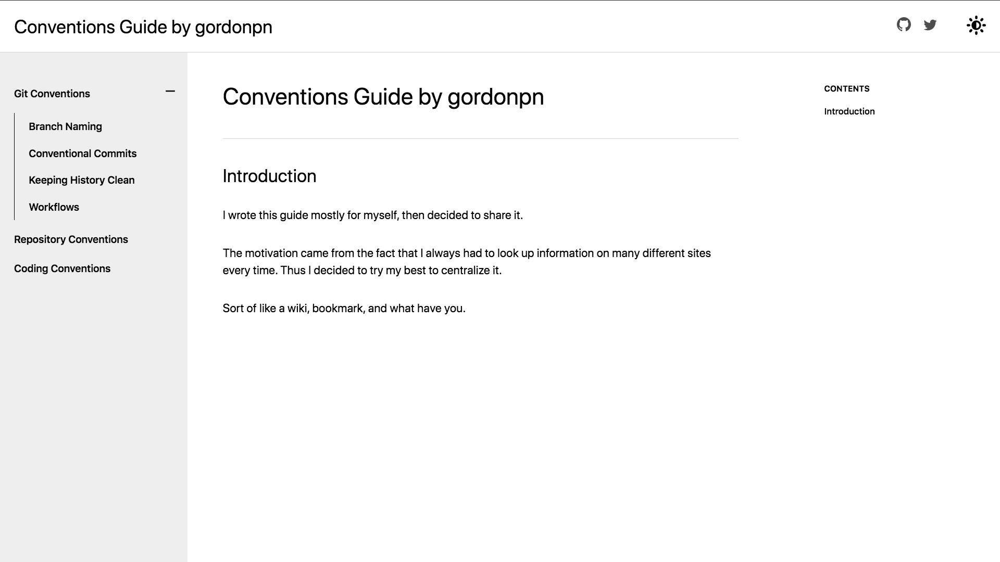

# (Personal) Conventions Guide

## Description

There is so much good information all over the internet. Here, I round up conventions about most Git related things that I personally follow.

## Motivation

Personally, I wanted a place where I can go and be reminded of Git project repository conventions if ever I forgot a detail. I also like documentation.

## Getting Started

See the live at https://conventions.gordon-pn.com

## Technologies

- Gatsby.js
- gatsby-theme-document plugin
- Docker and docker-compose

## Screenshot

## Contributing

[Contributing](./CONTRIBUTING.md)

## Support

You may open an issue for discussion.

## Authors

Myself [@gordonpn](https://github.com/gordonpn)

## License

[MIT License](./LICENSE)
