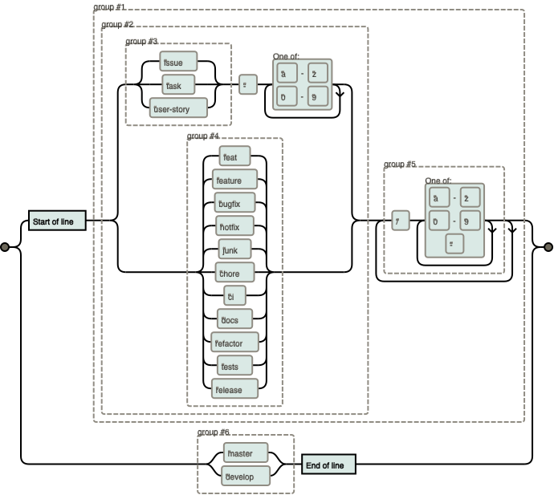

- Short, but descriptive.

    `oauth-migration` is good, but `login_fix` is vague and not good.

- Branch names should always be lowercase.

    `issue-9` to reference GitHub issue 9.

- Only use hyphens (dashes) to separate words, not camelCase, nor snake_case.
- When more than one person is working on the same feature, we may use tokens as such:

    ```
    feat/issue-1/master
    feat/issue-1/gordonpn
    feat/issue-1/bob
    feat/issue-1/alice
    ```

- Branches should be short-lived

    When a large amount of code is opened for a PR, the code review can be tedious.

- The master branch, is the branch that you are showing to the public, only commit high-quality code.

Git branches are separated by group tokens:

```
group1/foo
group2/foo
group1/bar
group2/bar
group3/bar
group1/baz
```

Examples of tokens:

```
feat                Feature I'm adding or expanding
feature             Same as above
bugfix              Bug fix or experiment
hotfix              Hot fix to be merged quickly
chore               Cleaning up / organizing code; chores!
docs                When adding or modifying documentation
refactor            Working on refactoring, no new code
release             Used for release branches
tests               When added tests or correcting tests
junk                Throwaway branch created to experiment
wip                 Works in progress
username            Your Git username
user-story-{id}     Identify the user story by id
issue-{id}          Identify the issue by id
task-{id}           Identify the task by id
```

Git branches may be further tokenized:

```
feat/user-story-6/brief-description
feat/feat-area/feat-name
hotfix/brief-description
bugfix/gordonpn/issue-4/right-click-unavailable
```

Full example:

```
wip/migrating-db-to-mongodb
```

Searching made easy:

```
git branch --list "feat/*"
```



__Also:__ Delete branches after they have merged.

