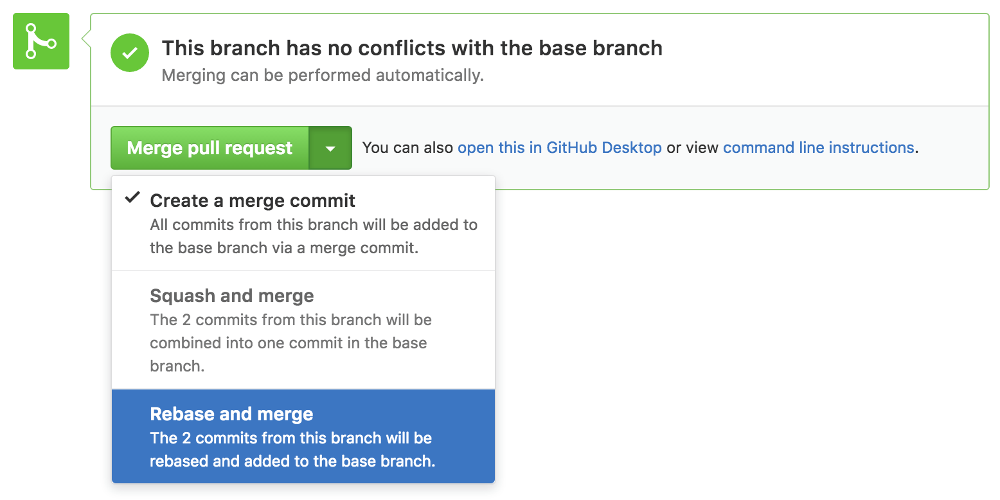
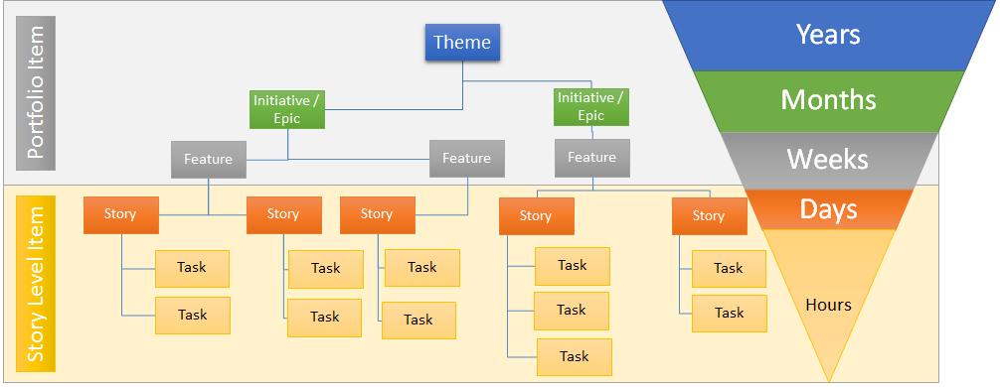

__Warning__: published history on branches such as master and develop should never be re-written.

### Updating branch with rebase

We may be used to and comfortable with `git pull origin develop` whenever we need to update our branch with the new changes on develop. We should know that the command pull combines both fetch and a merge, each time we use merge, a default commit message gets created and pollutes our git history.

With the merge method, we would usually be in our working branch, then run the command `git merge develop` to bring the changes into our branch. This method is __non-destructive__.

To keep a clean history, we can use `git pull --rebase origin develop`. Which is the same as doing `git fetch develop && git rebase origin/develop`

With the rebase flag, the command `git rebase develop` will be used and this will move our branch to the head of the develop branch. This re-writes the history and thus, is __destructive__ and should not be used with more than one contributor on the working branch.

### Pull Requests and Merges

#### Rebase

The merge & rebase technique can also be used when a pull request (PR) is made and the code review is over.



#### Squash

A merge & squash may be used as well, this way it shortens the commit history to a few commits. You can also give credits to multiple authors.

When writing the commit, add these lines at the end:

```md
Co-authored-by: name <name@example.com>
Co-authored-by: another-name <another-name@example.com>
```

### Re-writing history

#### Merge & Squash

Say we are working on two branches, the second is tracking from the first, we have many commits on the second branch that we want to bring into our first branch, but don't want to pollute the history.

We can squash all those commits from the second branch, into one commit with this flow:

```bash
git checkout feat/first
git merge --squash feat/second
git commit
```

In the last command, we are omitting the -m flag to open the interactive text editor to see all the commit messages we are squashing.

Of course, we can also use the previously mentioned technique of `git pull --rebase origin feat/second` to move the changes of the second branch to the head of the first branch to cleanly re-write history.

#### Squashing commits

Sometimes we end up with many WIP type commits, when we finally reach a working part of a feature, we'd like to squash all previous, probably nonsensical, commits into fewer commits.

To do that we use `git rebase -i head~N` where N is the number of commits we'd like to see in the interactive (-i) text editor.

#### Notes

It could sometimes be beneficial to leave the merge commit in the history on the master branch, especially when working with many contributors and/or a bigger project. This way we can see where the big changes happened. But do clean up your branch's commit history.

### Common Mistakes

#### Unstaging a file

It happens that we type `git add .` without realizing we staged unwanted files. If the changes haven't been pushed remotely yet, we can still undo the stages with:

`git restore --staged unwanted-file`

#### Editing the previous commit message

Maybe we forgot a detail to add into the previous commit message, we can use the `--amend` flag.

`git commit --amend`

__Warning__: This is a destructive operation, which means it should only be done on a branch where you are the only contributor, otherwise there will be git conflicts.

#### Forgot to stage a file with the previous commit

Sometimes we finish writing our commit message and then realize we forgot to stage a file with that commit!

First, we `git add forgotten-file` then `git commit --amend --no-edit`

#### More

Refer to [Dangit, Git!?!](https://dangitgit.com/)

## Issues



To add to the above image, tasks may also be bugs to fix. Tasks may have sub-tasks.

The typical user story goes as such:

```text
As a <Role/User Type/Who>, I want <Goal/Function/What>, so that <Benefit/Why>.
When <Situation>, I want to <Motivation>, so I can <Expected outcome>.

Acceptance criteria
```

You may find templates for issues in [ISSUE_TEMPLATE](https://github.com/gordonpn/conventions-guide/blob/master/docs/ISSUE_TEMPLATE).

You can copy the `ISSUE_TEMPLATE` folder into the `docs` folder or the `.github` folder and they will appear when trying to open an issue.

## Pull Requests

In a pull request,

- We describe how this PR will change the code in develop or master.
- Which areas of the application is affected by the PR.
- Which issues it will close.
- You may also talk about any deployment notes and how to test the changes.

_Tip_: using keywords such as "closes", "fixes", "resolves" will automatically close issues that you are referencing.

You may find a template for pull requests in [PULL_REQUEST_TEMPLATE](https://github.com/gordonpn/conventions-guide/blob/master/docs/PULL_REQUEST_TEMPLATE).

You can copy the `PULL_REQUEST_TEMPLATE` folder into the `docs` folder or `.github` folder and they will appear when trying to open an issue.
