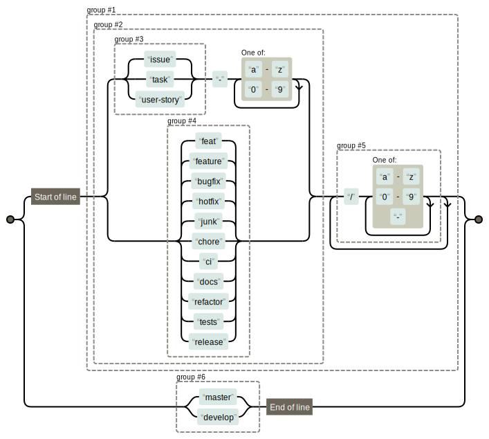

<!-- TOC -->

- [1. Git](#1-git)
    - [1.1. Workflows](#11-workflows)
        - [1.1.1. Gitflow Workflow](#111-gitflow-workflow)
        - [1.1.2. Git Feature Branch Workflow](#112-git-feature-branch-workflow)
    - [1.2. Conventional Commits](#12-conventional-commits)
        - [1.2.1. Messages](#121-messages)
        - [1.2.2. Reverting Commits](#122-reverting-commits)
    - [1.3. Branch Naming](#13-branch-naming)
    - [1.4. Keeping history clean (Merging)](#14-keeping-history-clean-merging)
        - [1.4.1. Updating branch with rebase](#141-updating-branch-with-rebase)
        - [1.4.2. Pull Requests and Merges](#142-pull-requests-and-merges)
            - [1.4.2.1. Rebase](#1421-rebase)
            - [1.4.2.2. Squash](#1422-squash)
        - [1.4.3. Re-writing history](#143-re-writing-history)
            - [1.4.3.1. Merge & Squash](#1431-merge--squash)
            - [1.4.3.2. Squashing commits](#1432-squashing-commits)
            - [1.4.3.3. Notes](#1433-notes)
        - [1.4.4. Common Mistakes](#144-common-mistakes)
            - [1.4.4.1. Unstaging a file](#1441-unstaging-a-file)
            - [1.4.4.2. Editing the previous commit message](#1442-editing-the-previous-commit-message)
            - [1.4.4.3. Forgot to stage a file with the previous commit](#1443-forgot-to-stage-a-file-with-the-previous-commit)
            - [1.4.4.4. More](#1444-more)
    - [1.5. Issues](#15-issues)
    - [1.6. Pull Requests](#16-pull-requests)
- [2. Coding Conventions](#2-coding-conventions)
    - [2.1. Test Driven Development](#21-test-driven-development)
    - [2.2. Refactoring](#22-refactoring)
- [3. Repository](#3-repository)
    - [3.1. README](#31-readme)
    - [3.2. License](#32-license)
    - [3.3. Changelog](#33-changelog)
    - [3.4. Contributing](#34-contributing)
    - [3.5. Code Owners](#35-code-owners)
        - [3.5.1. Syntax](#351-syntax)
    - [3.6. Support](#36-support)
    - [3.7. Code of Conduct](#37-code-of-conduct)

<!-- /TOC -->

# 1. Git

## 1.1. Workflows

### 1.1.1. Gitflow Workflow

The Gitflow was published and popularized by [Vincent Driessen](http://nvie.com/posts/a-successful-git-branching-model/).

In summary,

1. Master branch will only have high-quality code and only interacts with release branches.
2. Develop branch is forked from master.
3. Feature branches are forked from develop and merges back into develop.
4. When develop has enough features, a release branch is forked from develop.
    - Only bug fixes and documentation may be merged into release branches.
    - Release branches have the `release` token, e.g. `release/0.1.0` is a good release branch name.
    - When it is ready, the release branch is pushed with a tag name, such as `v1.2.3` where `1.2.3` follows [semantic versioning guidelines](https://semver.org/).
    - The release branch is merged into master and into develop.

5. Hotfix branches are used when there is an application-breaking bug in production (master).
    - The hotfix branch is forked from master, the fix is implemented and merged back into master as well as develop and current release branch if there is one.
    - Update the version tag of master.

### 1.1.2. Git Feature Branch Workflow

A simpler workflow is also often used, you can find more details on [Atlassian Git Tutorials](https://www.atlassian.com/git/tutorials/comparing-workflows/feature-branch-workflow)

## 1.2. Conventional Commits

- A commit is one single _logical change_. Don't commit several logical changes, it ends up being harder to follow and understand.
- Use the interactive text editor to write meaningful commits `git commit` (omitting the -m).
- Commit often and early, but push less frequently (only when you're sure).

### 1.2.1. Messages

Follow the [Conventional Commits](https://www.conventionalcommits.org/) and [Angular guidelines](https://docs.google.com/document/d/1QrDFcIiPjSLDn3EL15IJygNPiHORgU1_OOAqWjiDU5Y/edit#).

To summarize,

```md
<type>(<scope>): <subject>
<BLANK LINE>
<body>
<BLANK LINE>
<footer>
```

- All messages are always in present imperative tense. "change", not "changes" nor "changed".
- Always lowercase.
- Do not end sentences or phrases with periods.
- Types possible:

    ```md
    feat    feature
    fix     bug fix
    docs    documentation
    style   formatting, missing semi colons, etc.
    refactor
    test    when adding missing tests, or correcting
    chore   maintain
    build   affects build system or external dependencies
    ci      change to CI configuration and scripts
    perf    improves performance
    ```

- Scope is the scope in which the commit is related to. May be omitted.
- The body explains why, how and side-effects.
- Footer is where you may reference issues and make note of breaking changes.

    If there is a breaking change, it must be written in uppercase and the type must hav a `!`

    ```md
    refactor!: drop support for Java 8

    refs #134, #146
    BREAKING CHANGE: using new features of Java 13, must drop support for Java 8
    ```

### 1.2.2. Reverting Commits

It might happen that we commit a change and push it to remote, but we need to undo it.

This calls for a revert `git revert HEAD`. This will open a text editor where you can write about why the commit needed to be reverted. When you're done, save and close the editor.

## 1.3. Branch Naming

- Short, but descriptive.

    `oauth-migration` is good, but `login_fix` is vague and not good.

- Branch names should always be lowercase.

    `issue-9` to reference GitHub issue 9.

- Only use hyphens (dashes) to separate words, not camelCase, nor snake_case.
- When more than one person is working on the same feature, we may use tokens as such:

    ```md
    feat/issue-1/master
    feat/issue-1/gpnn
    feat/issue-1/bob
    feat/issue-1/tremblay
    ```

- Branches should be short-lived

    When a large amount of code is opened for a PR, the code review can be tedious.

- The master branch, is the branch that you are showing to the public, only commit high-quality code.

Git branches are separated by group tokens:

```md
group1/foo
group2/foo
group1/bar
group2/bar
group3/bar
group1/baz
```

Examples of tokens:

```md
feat                Feature I'm adding or expanding
feature             Same as above
bugfix              Bug fix or experiment
hotfix              Hot fix to be merged quickly
chore               Cleaning up / organizing code; chores!
docs                When adding or modifying documentation
refactor            Working on refactoring, no new code
release             Used for release branches
tests               When added tests or correcting tests
junk                Throwaway branch created to experiment
wip                 Works in progress
username            Your Git username
user-story-{id}     Identify the user story by id
issue-{id}          Identify the issue by id
task-{id}           Identify the task by id
```

Git branches may be further tokenized:

```md
feat/user-story-6/brief-description
feat/feat-area/feat-name
hotfix/brief-description
bugfix/gpnn/issue-4/right-click-unavailable
```

Full example:

```md
wip/migrating-db-to-mongodb
```

Searching made easy:

```md
git branch --list "feat/*"
```



__Also:__ Delete branches after they have merged.

## 1.4. Keeping history clean (Merging)

__Warning__: published history on branches such as master and develop should never be re-written.

### 1.4.1. Updating branch with rebase

We may be used to and comfortable with `git pull origin develop` whenever we need to update our branch with the new changes on develop. We should know that the command pull combines both fetch and a merge, each time we use merge, a default commit message gets created and pollutes our git history.

With the merge method, we would usually be in our working branch, then run the command `git merge develop` to bring the changes into our branch. This method is __non-destructive__.

To keep a clean history, we can use `git pull --rebase origin develop`. Which is the same as doing `git fetch develop && git rebase origin/develop`

With the rebase flag, the command `git rebase develop` will be used and this will move our branch to the head of the develop branch. This re-writes the history and thus, is __destructive__ and should not be used with more than one contributor on the working branch.

### 1.4.2. Pull Requests and Merges

#### 1.4.2.1. Rebase

The merge & rebase technique can also be used when a pull request (PR) is made and the code review is over.


#### 1.4.2.2. Squash

A merge & squash may be used as well, this way it shortens the commit history to a few commits. You can also give credits to multiple authors.

When writing the commit, add these lines at the end:

```md
Co-authored-by: name <name@example.com>
Co-authored-by: another-name <another-name@example.com>
```

### 1.4.3. Re-writing history

#### 1.4.3.1. Merge & Squash

Say we are working on two branches, the second is tracking from the first, we have many commits on the second branch that we want to bring into our first branch, but don't want to pollute the history.

We can squash all those commits from the second branch, into one commit with this flow:

```bash
git checkout feat/first
git merge --squash feat/second
git commit
```

In the last command, we are omitting the -m flag to open the interactive text editor to see all the commit messages we are squashing.

Of course, we can also use the previously mentioned technique of `git pull --rebase origin feat/second` to move the changes of the second branch to the head of the first branch to cleanly re-write history.

#### 1.4.3.2. Squashing commits

Sometimes we end up with many WIP type commits, when we finally reach a working part of a feature, we'd like to squash all previous, probably nonsensical, commits into fewer commits.

To do that we use `git rebase -i head~N` where N is the number of commits we'd like to see in the interactive (-i) text editor.

#### 1.4.3.3. Notes

It could sometimes be beneficial to leave the merge commit in the history on the master branch, especially when working with many contributors and/or a bigger project. This way we can see where the big changes happened. But do clean up your branch's commit history.

### 1.4.4. Common Mistakes

#### 1.4.4.1. Unstaging a file

It happens that we type `git add .` without realizing we staged unwanted files. If the changes haven't been pushed remotely yet, we can still undo the stages with:

`git restore --staged unwanted-file`

#### 1.4.4.2. Editing the previous commit message

Maybe we forgot a detail to add into the previous commit message, we can use the `--amend` flag.

`git commit --amend`

__Warning__: This is a destructive operation, which means it should only be done on a branch where you are the only contributor, otherwise there will be git conflicts.

#### 1.4.4.3. Forgot to stage a file with the previous commit

Sometimes we finish writing our commit message and then realize we forgot to stage a file with that commit!

First, we `git add forgotten-file` then `git commit --amend --no-edit`

#### 1.4.4.4. More

Refer to [Dangit, Git!?!](https://dangitgit.com/)

## 1.5. Issues


To add to the above image, tasks may also be bugs to fix. Tasks may have sub-tasks.

The typical user story goes as such:

```text
As a <Role/User Type/Who>, I want <Goal/Function/What>, so that <Benefit/Why>.
When <Situation>, I want to <Motivation>, so I can <Expected outcome>.

Acceptance criteria
```

You may find templates for issues in [ISSUE_TEMPLATE](docs/ISSUE_TEMPLATE).

You can copy the `ISSUE_TEMPLATE` folder into the `docs` folder or the `.github` folder and they will appear when trying to open an issue.

## 1.6. Pull Requests

In a pull request,

- We describe how this PR will change the code in develop or master.
- Which areas of the application is affected by the PR.
- Which issues it will close.
- You may also talk about any deployment notes and how to test the changes.

_Tip_: using keywords such as "closes", "fixes", "resolves" will automatically close issues that you are referencing.

You may find a template for pull requests in [PULL_REQUEST_TEMPLATE](docs/PULL_REQUEST_TEMPLATE).

You can copy the `PULL_REQUEST_TEMPLATE` folder into the `docs` folder or `.github` folder and they will appear when trying to open an issue.

# 2. Coding Conventions

## 2.1. Test Driven Development

I believe TDD to be a great development process.

First, you write a test that will obviously fail (because you don't have any code yet).

Second, write some code to make that test pass.

Third, refactor as needed and repeat from step one.

## 2.2. Refactoring

Before refactoring, write tests with near 100% coverage. With that, refactoring will be safer from producing bugs.

# 3. Repository

## 3.1. README

Usually in the root of the repo. Can be named `readme.md` or `README.md`, with or without the extension. It could also be stored in `docs/` or `.github/`.

This is the file that all visitors will see when they visit your repo. It should be the only file that you should expect your visitors to read, so it should be as concise and straight to the point as possible, starting with the most important points.

Refer to [README_template.md](docs/README_template.md) for an outline.

## 3.2. License

State the license under which you are publishing your project, otherwise the default copyright laws apply.

For help choose a license, refer to [choosealicense.com](http://choosealicense.com/)

## 3.3. Changelog

The `CHANGELOG.md` tracks important changes in a easy-to-read file.

If the conventional commits guidelines are followed, then a changelog can be quickly generated using tools such as:

- [conventional-changelog npm package](https://github.com/conventional-changelog/conventional-changelog/tree/master/packages/conventional-changelog-cli)
- [standard-version npm package](https://github.com/conventional-changelog/standard-version)
- [changelog-generator vscode extension](https://marketplace.visualstudio.com/items?itemName=axetroy.vscode-changelog-generator)

## 3.4. Contributing

Set guidelines for contributing to your project by creating a `CONTRIBUTING.md` file in the root, `docs/`, or `.github/` folder.

Here you can list:

- Steps to opening good issues, or pull requests
- Accepted types of contributions
- List resources, how to talk with other developers
- Coding conventions you use for your project

Some very good real-life examples of `CONTRIBUTING.md`:

- [Atom editor](https://github.com/atom/atom/blob/master/CONTRIBUTING.md)
- [Rails framework](https://github.com/rails/rails/blob/f68c1ef3ede1ffe84f62ca5eaebd3d9648bdd86c/CONTRIBUTING.md)
- [OpenGovernment](https://github.com/opengovernment/opengovernment/blob/master/CONTRIBUTING.md)

Also refer to [CONTRIBUTING_template.md](docs/CONTRIBUTING_template.md) which is from [contributing-template](https://github.com/nayafia/contributing-template).

## 3.5. Code Owners

The `CODEOWNERS` files is a file that resides either in the root of the repo, the `docs/` folder or the `.github/` folder.

The main purpose of the file is specify who are the code owners of this repo. When a PR is opened, the correct code owners will be automatically requested review.

### 3.5.1. Syntax

This section is directly from [GitHub](https://help.github.com/en/github/creating-cloning-and-archiving-repositories/about-code-owners#codeowners-syntax).

Refer for [CODEOWNERS_template](docs/CODEOWNERS_template) for examples and a template.

_Note that this file does not have an `.md` extension._

## 3.6. Support

The `SUPPORT.md` file is useful to let the users know how they can get in touch with you, if you'd like that. This file will also be linked on the right hand side when a user clicks on __New Issue__.

## 3.7. Code of Conduct

> A code of conduct is a document that establishes expectations for behavior for your project’s participants. Adopting, and enforcing, a code of conduct can help create a positive social atmosphere for your community.
>
> -- [opensource.guide](https://opensource.guide/code-of-conduct/)

From the main page of your repository, click on __Create new File__, type `CODE_OF_CONDUCT.md` into the filename field and GitHub will suggest templates on the left hand side.
